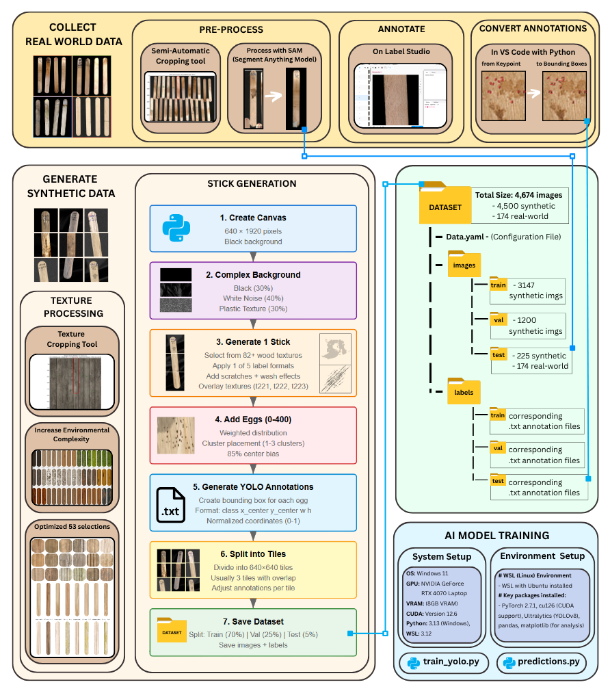

This Repository is a dynamic Appendix for Theo Syriopoulos' Bachelor Thesis report on "AI Detection & Counting of Mosquito Eggs" for his bachelors in Creative Technology at the University of Twente. 
The full report will availble here (xxx) once officially releasesd on the university's platform.  

 
In this Appendix you can find the following material;

A - Stick_With_Eggs_Generator Python Jupyter Notebook is the main file for synthetic data generation, including synthetic annotations and dataset structure creation in yolo format. 
B - Semi-Automatic Cropping tool for processing raw real_world data  
C - Texture Process Tool for processesing 18 textures and capturing unique selection in a Json file used in Stick_With_Eggs_Generator  
D - train_yolo_single_class.py Trains the synthetically generated dataset in with yolov8n trained to detect Mosquito Eggs  
E - train_yolo_double_class.py Trains the synthetically generated dataset in with yolov8n splitting detection of eggs in two classes; Small eggs (3-7 pixels) and Large eggs (7-13 pixels)  
F - predictions.py visualises the model's predictions in an interactive UI including Confidence and IuO thershold slider  
G - Folder with AI model weights and Model Metrics (constant conf=0.20, iou=0.6,)  
 
Resources for replication can be found in the following dropbox: 
https://www.dropbox.com/scl/fo/upm21t7k9fp4wp41043fd/ACeTDudjz5vwTny_Ea9zsZE?rlkey=8ytszhbdavs2m4vi7l6jcs9o3&st=ahfq392v&dl=0
 
 
Dropbox Includes; 

H - The Complete Final Dataset Generated (with real-world processed images in testing folder)  
I - Prediction Visualisations  
J - Textures folder with all the Wodden textures used and config.json files that amplifies selections  
K - Fonts folder with all the handwritten fonts used for synthetic labels  
L - Raw Real-World Data for reference  
 

In order to use the Stick With Eggs Generator, you must first dowload python 3.13.2 and material J and K (TEXTURES and fonts, located on Dropbox), then update the script with your local paths to the location of the these files respectively, and set a local output directory.

 
**Worflow Diagram:**

